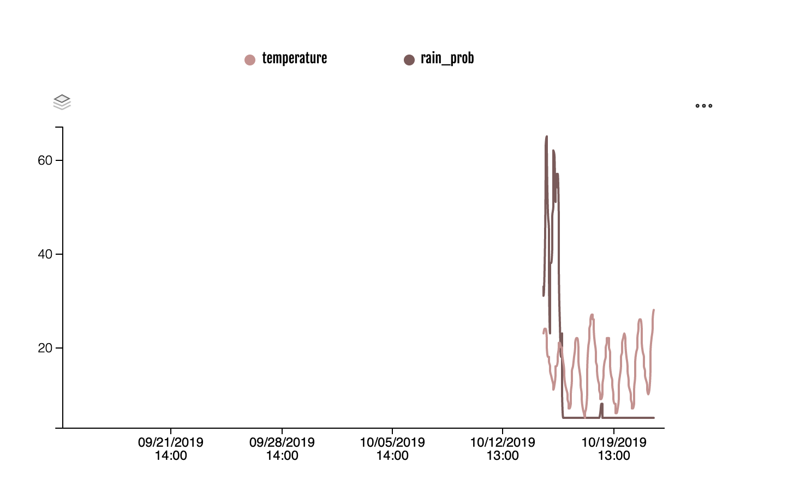

[](https://dev.azure.com/amphoradata/Public/_build/latest?definitionId=6&branchName=master)

# WeatherZone ETL Sample

This sample shows you how to *Load* data from an external web API (in this case the WeatherZone API), *Transform* into an Amphora supported format, and *Load* into an Amphora for use on the Amphora Data platform.

## Prerequisites

* Have an Amphora Data account.
* Have Python or Docker installed.

# Quickstart

## Create an Amphora.

Create an Amphora to hold your data. Make sure to give the Amphora a meaningful name, description, and location, so that consumers of the data know what they are getting.

> Navigate to `Amphorae` in the Nav Bar, and click the blue `Create` button.

## Add Signal Properties to your Amphora.

We're going to be tracking the numeric temperature and rain probability forecasts, as well as the description of the weather and the time the prediction was loaded from WeatherZone. To do this we need to add these as *Properties* to our Amphora, so the platform knows what data to expect (and what to reject!)

> Click `Signals` in the Amphora details page, and then click the `+` button to add a Property.

We're going to add the following properties:

| Property Name   | Property Type | Weatherzone Property Name |
|-----------------|---------------|---------------------------|
| temperature     | numeric       | temperature               |
| rain_prob       | numeric       | rain_prob                 |
| prediction_time | string        | -                         |
| description     | string        | icon_phrase               |

You don't need to explicity add the `t` property (the timestamp property). This is included by default on every signal, and defaults to the current UTC time. 

## Copy the Id of the Amphora

Now we've created an Amphora for our weather data, we can run the scripts in this repository. First, however, you'll need to replace the Amphora Id in [the environment file](.env) with the Id of the Amphora you just created. You can find the Id in your browsers navigation bar.

> Copy the Amphora Id from the browsers navigation bar

## Check your environment variables

[The environment file](.env) contains configuration information. You'll need to set the following:

wz_user -> Your WeatherZone API username. If you don't have one, you can leave this blank and change the code to pull from the github gist.
wz_password -> WeatherZone API password. See note above.
wz_lc -> WeatherZone location code.
username -> Amphora Data username
password -> Amphora Data password. Keep this secret!
host -> Amphora Data host. Probably `https://beta.amphoradata.com`
amphora_id -> the Id you copied in the step above.

## Run the code.

### Using docker compose

```sh
docker-compose run index
```

### Using Python

```sh
pip install -r requirements.txt
python index.py
```

## View the Signals

You should now be able to view the weather data on the Amphora Data website. Note that it may take up to a minute for the signal data to become available, and look something like below. Note that string properties are not plottable.



# Schedule the job

There are many ways to schedule the job we've just coded. You could use a serverless platform like [Azure Functions](https://azure.microsoft.com/en-in/services/functions/) or [AWS Lambda](https://aws.amazon.com/lambda/), a CRON job in Linux or Kubernetes, or just schedule an appointment in your calendar and run it manually.

In this example, we're going to use [Azure Pipelines](https://azure.microsoft.com/en-au/services/devops/pipelines/).

## Get an Azure Devops Account

Go to [Azure DevOps](https://dev.azure.com) and sign up, or sign in with an existing account.

## Create variable groups with your credentials.

Create two [variable groups](https://docs.microsoft.com/en-us/azure/devops/pipelines/library/variable-groups?view=azure-devops&tabs=yaml) in Azure Pipelines: `AmphoraData` and `WeatherZone`. 

### AmphoraData Variable Group

This group contains the following variables:

* `host` - the Amphora Data host URL - probably https://beta.amphoradata.com
* `username` - your Amphora Data username - probably your email.
* `password` - your password. Make this a secret by clicking the lock button.

### WeatherZone Variable Group

This group contains the following variables:

* `wz_user` - your WeatherZone API user id.
* `wz_password` - your WeatherZone api password.


## Fork this repository

You'll need to give your Azure Pipelines account access to this repository. The easiest way to do that is to [fork](https://help.github.com/en/articles/fork-a-repo) this repository so you have your own copy.


## Create a build pipeline

Create a [new build pipeline](https://docs.microsoft.com/en-us/azure/devops/pipelines/create-first-pipeline), and choose the option to connect to a YAML file from GitHub. Select the repo you just created by forking this one, and find the [azure-pipelines.yml](azure-pipelines.yml) file.

## Run the build pipeline.

This build pipeline is scheduled to run every 6 hours. You can change those settings in [azure-pipelines.yml](azure-pipelines.yml).


